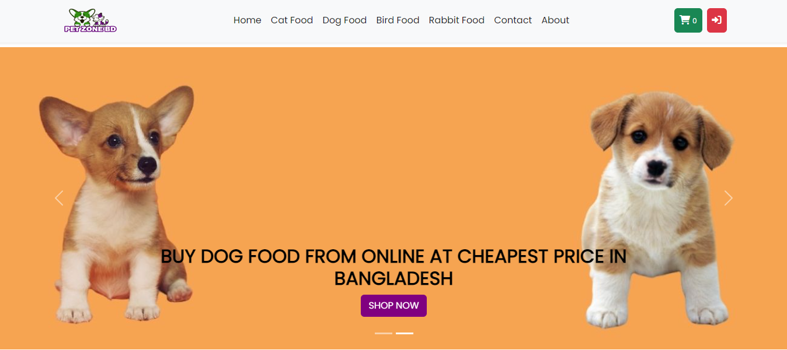
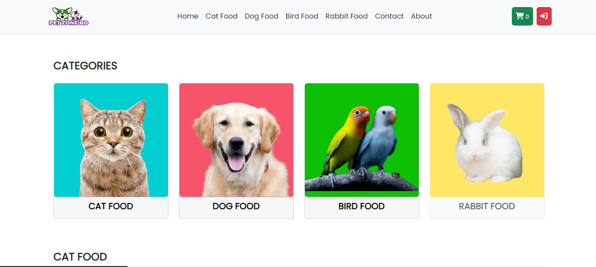
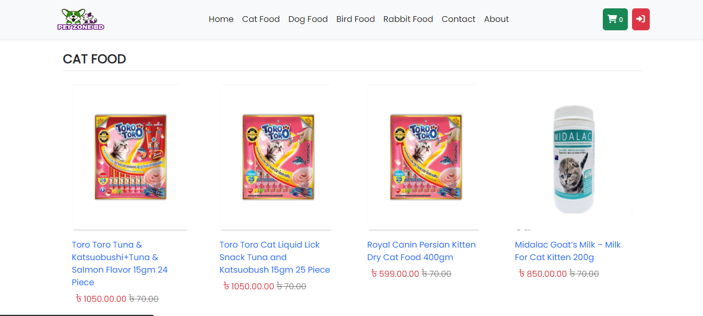
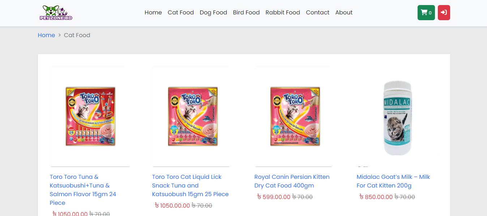
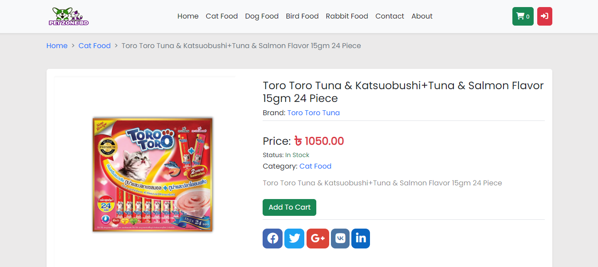
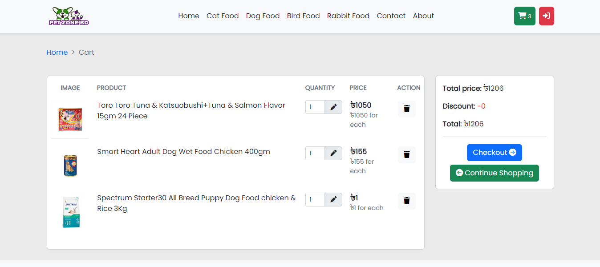
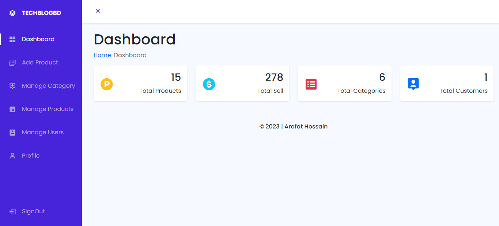

# petzonebd
 Online pet food shop with e-commerce integration
 
 

# Getting started

## Installation

Please check the official laravel installation guide for server requirements before you start. [Official Documentation](https://laravel.com/docs/9.x)

Clone the repository

    git clone https://github.com/arafat-web/petzonebd.git

Switch to the repo folder

    cd petzonebd

Install all the dependencies using composer

    composer install

Copy the example env file and make the required configuration changes in the .env file

    cp .env.example .env

Generate a new application key

    php artisan key:generate

Generate a new JWT authentication secret key

    php artisan jwt:generate

Run the database migrations (**Set the database connection in .env before migrating**)

    php artisan migrate

Start the local development server

    php artisan serve

You can now access the server at http://localhost:8000

# Screenshots

## Home

 
 
 
 
## Categories

 

## Single Products

 
 
## Cart

 
 
## Admin

 

 

 # Thanks
