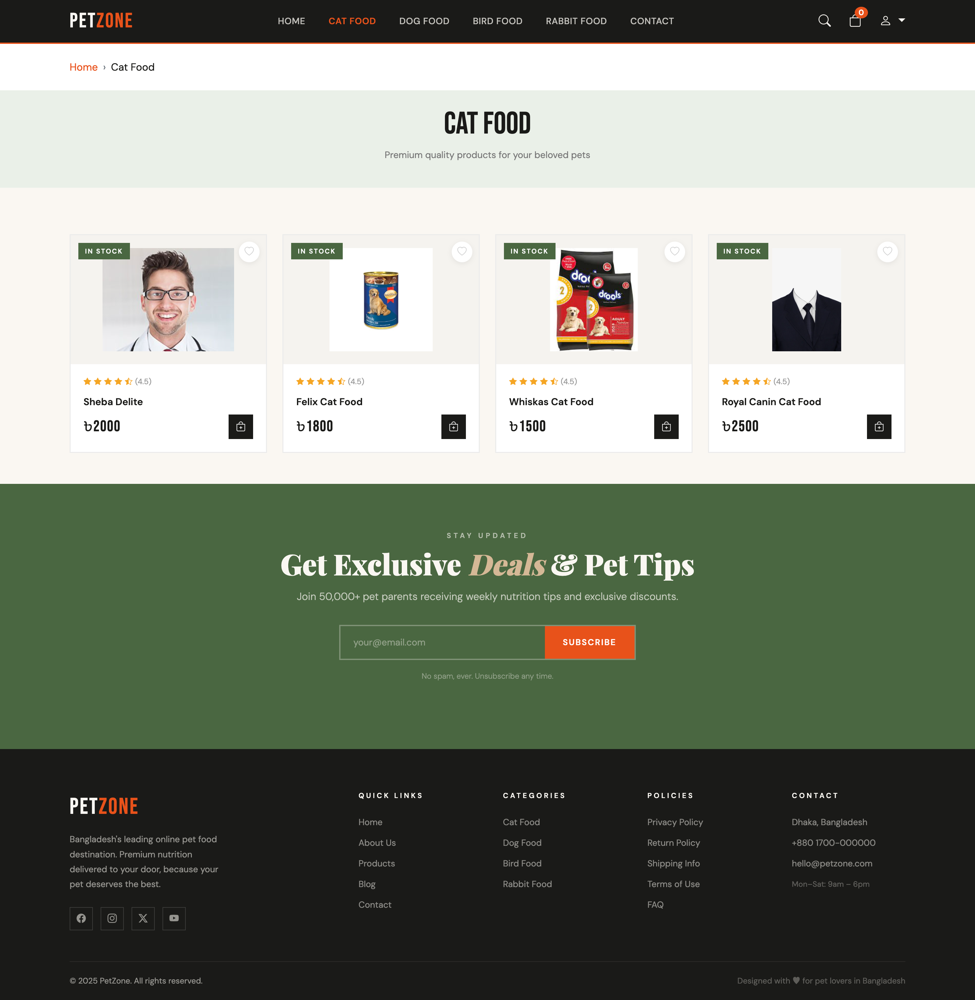
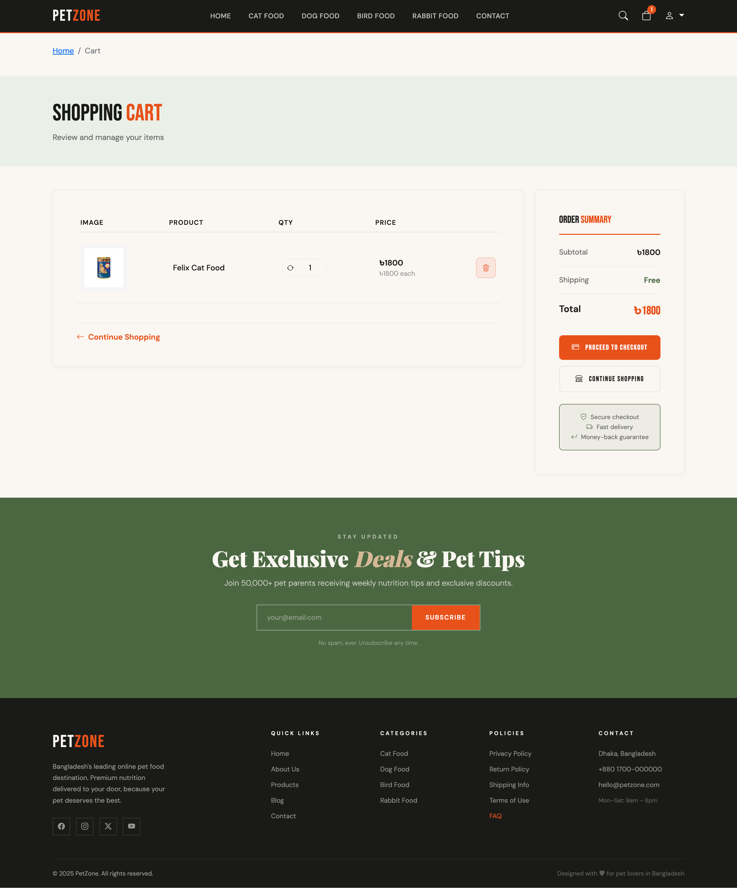
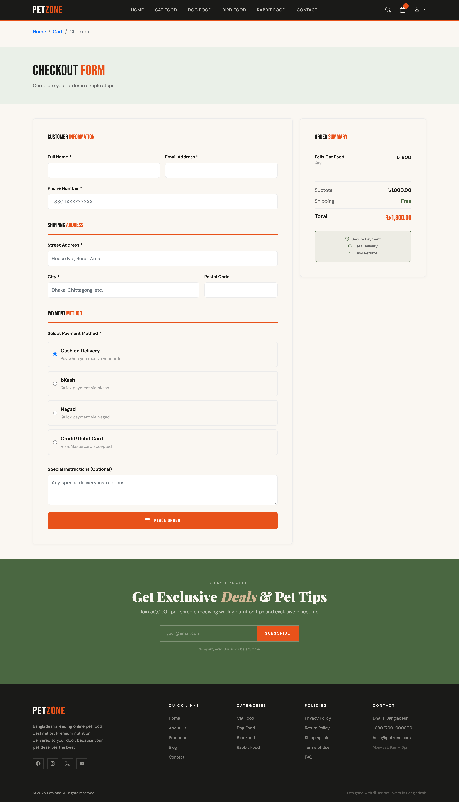
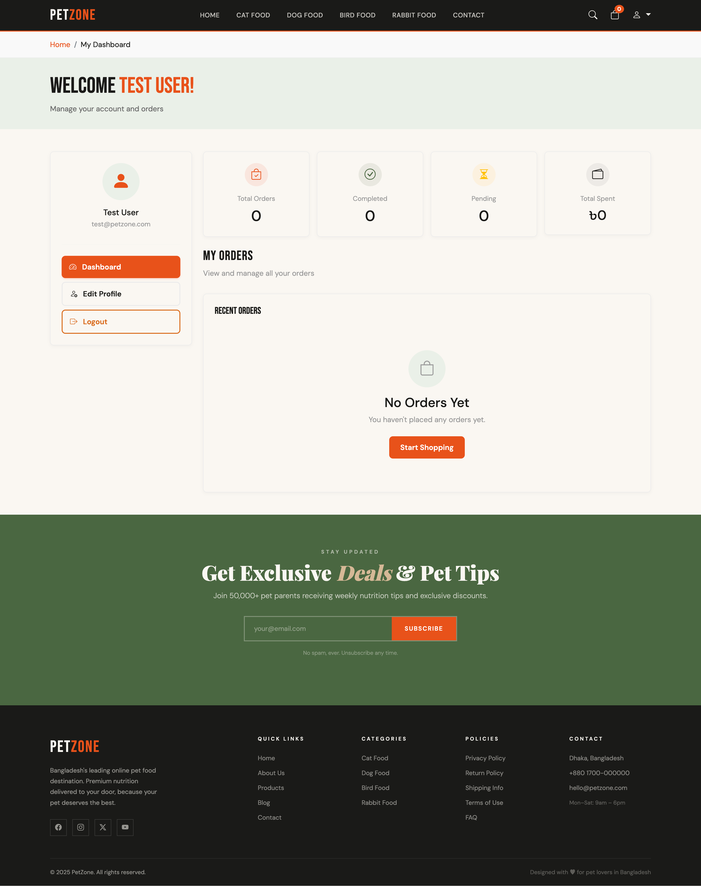

# PetZoneBD - Online Pet Food Shop

A modern, full-featured e-commerce platform for pet food and supplies with comprehensive admin dashboard and customer portal.

---

## About PetZoneBD

PetZoneBD is a professional-grade e-commerce solution designed specifically for pet food retailers and suppliers. The platform provides a seamless shopping experience for customers while offering robust management tools for store administrators. Built with modern web technologies and best practices, PetZoneBD enables businesses to manage product catalogs, process orders, track inventory, and build customer relationships efficiently.

The platform is designed to scale with your business, supporting multiple product categories, promotional features like discounts, customer accounts with order history, and comprehensive analytics through the admin dashboard.

---

## Technology Stack

- **Framework**: Laravel 12.x (PHP)
- **PHP Version**: 8.2+ (Latest stable)
- **Caching**: Laravel Cache (24-hour category caching)
- **Server**: Apache/Nginx with PHP 8.2+


---

## Core Features

### Customer Features
- Real-time AJAX Search: Instant product search with dropdown results
- Product Browsing: Browse products by category with filtering
- Product Details: Comprehensive product information with pricing and discounts
- Shopping Cart: Full-featured cart with quantity adjustments
- Secure Checkout: Multi-step checkout with order confirmation
- Order History: View detailed order information and status
- User Profile: Manage personal information and account settings
- Responsive Design: Fully functional on desktop, tablet, and mobile devices
- Wishlist Ready: Foundation for future wishlist features
- Product Reviews Ready: Integration points for customer reviews

### Discount & Pricing
- Product Discounts: Percentage-based discount system
- Display Pricing: Automatic calculation and display of discounted prices
- Real-time Pricing: Dynamic price updates in cart and checkout
- Discount Badge: Visual indicators on product cards

### Admin Features
- Admin Dashboard: Comprehensive overview with metrics
- Product Management: Full CRUD operations for products
- Category Management: Organize and manage product categories
- Order Management: View, process, and track customer orders
- Discount Management: Set and manage product discounts per category basis
- Settings Management: Configure store settings and preferences
- User Management: View and manage user accounts
- Role-Based Controls: Separate admin and customer authentication
- Analytics Ready: Foundation for business metrics and reporting

### Technical Features
- Category Caching: 24-hour intelligent caching for performance
- SEO-Friendly URLs: Slug-based routing for search visibility
- Session Management: Secure user session handling
- Error Handling: Comprehensive error handling and validation
- AJAX Features: Real-time search and dynamic content loading
- Mobile Responsive: Mobile-first responsive design
- Form Validation: Client and server-side validation
- Security: CSRF protection, password hashing, input sanitization
- Pagination: Efficient data loading with pagination

---

## Screenshots

### Homepage


Main landing page featuring product showcase, category navigation, and promotional content.

### Product Category Browsing


Category page showing products with images, prices, discounts, and quick add-to-cart.

### Shopping Cart


Shopping cart interface with quantity adjustments, total calculation, and checkout.

### Checkout Process


Secure checkout page with delivery info, order summary, and payment options.

### Customer Dashboard


Personal dashboard for order history, profile management, and account settings.

---

## Installation & Setup

### Requirements
- PHP 8.2 or higher
- Composer
- Node.js & NPM (16+)
- MySQL 5.7 or higher
- Web server (Apache/Nginx)
- Git

### Quick Start

1. Clone the repository
```bash
git clone https://github.com/arafat-web/petzonebd-Online-Pet-Food-Shop.git
cd petzonebd-Online-Pet-Food-Shop
```

2. Install dependencies
```bash
composer install
npm install
```

3. Configure environment
```bash
cp .env.example .env
php artisan key:generate
```

4. Database setup
```bash
php artisan migrate
php artisan db:seed
```

5. Build assets
```bash
npm run build
```

6. Serve the application
```bash
php artisan serve
```

Access the application at http://localhost:8000

### Test Credentials

**Admin Panel:**
- Email: admin@petzone.com
- Password: admin@123

**Customer Account:**
- Email: test@petzone.com
- Password: test@123

---

## Project Structure

```
petzonebd/
├── app/
│   ├── Http/
│   │   ├── Controllers/
│   │   │   ├── AdminController.php
│   │   │   ├── ClientController.php
│   │   │   ├── CartController.php
│   │   │   ├── CheckoutController.php
│   │   │   ├── SearchController.php
│   │   │   ├── UserController.php
│   │   │   ├── ProductController.php
│   │   │   ├── CategoryController.php
│   │   │   └── OrderController.php
│   │   ├── Middleware/
│   │   │   └── IsAdmin.php
│   │   └── Kernel.php
│   ├── Models/
│   │   ├── User.php
│   │   ├── Product.php
│   │   ├── Category.php
│   │   ├── Order.php
│   │   ├── Payment.php
│   │   └── Settings.php
│   ├── Providers/
│   │   ├── AppServiceProvider.php
│   │   └── RouteServiceProvider.php
│   ├── Services/
│   │   └── CategoryCacheService.php
│   └── Helpers/
│       └── ImageHelper.php
├── database/
│   ├── migrations/
│   ├── seeders/
│   └── factories/
├── resources/
│   ├── views/
│   │   ├── admin/
│   │   │   ├── dashboard/
│   │   │   ├── products/
│   │   │   ├── categories/
│   │   │   ├── orders/
│   │   │   └── settings/
│   │   ├── client/
│   │   │   ├── home/
│   │   │   ├── products/
│   │   │   ├── product/
│   │   │   ├── cart/
│   │   │   ├── checkout/
│   │   │   ├── auth/
│   │   │   └── include/
│   │   └── layouts/
│   ├── css/
│   └── js/
├── routes/
│   ├── web.php
│   ├── api.php
│   └── console.php
├── public/
│   ├── images/
│   ├── css/
│   ├── js/
│   └── index.php
├── config/
├── bootstrap/
├── storage/
├── tests/
└── composer.json
```

---

## Future Enhancements

- Payment gateway integration (Stripe, bKash, Nagad)
- Email notifications for orders and updates
- Product reviews and customer ratings
- Wishlist and favorites functionality
- Advanced inventory management
- Multiple payment methods and installments
- SMS notifications for order updates
- Customer loyalty and reward program
- Product recommendations based on purchase history
- Admin email reports and analytics
- Multi-language support
- Social media integration

---

## Troubleshooting

### Common Issues

**Database connection error**
- Check .env file DATABASE_URL and credentials
- Ensure MySQL server is running
- Verify database exists

**Permission denied errors**
- Run: chmod -R 775 storage bootstrap/cache
- Ensure web server has write permissions

**Cache issues**
- Clear cache: php artisan cache:clear
- Clear config: php artisan config:clear
- Clear views: php artisan view:clear

**Composer conflicts**
- Run: composer update
- Remove composer.lock and run: composer install

---

## Contributing

Contributions are welcome! Please follow these steps:

1. Fork the repository
2. Create a feature branch (git checkout -b feature/AmazingFeature)
3. Commit your changes (git commit -m 'Add AmazingFeature')
4. Push to the branch (git push origin feature/AmazingFeature)
5. Open a Pull Request

---

## License

This project is open source and available under the MIT License. See LICENSE file for details.

---

## Support

For questions or support:
- Email: support@petzonebd.com
- GitHub Issues: Create an issue on the project repository
- Documentation: Check docs folder for detailed guides

---

## Author

Built with passion for pet lovers and e-commerce excellence.

**Version**: 3.0 (Laravel 12)
**Last Updated**: February 2026
**Maintainer**: Arafat Hossain
**License**: MIT
